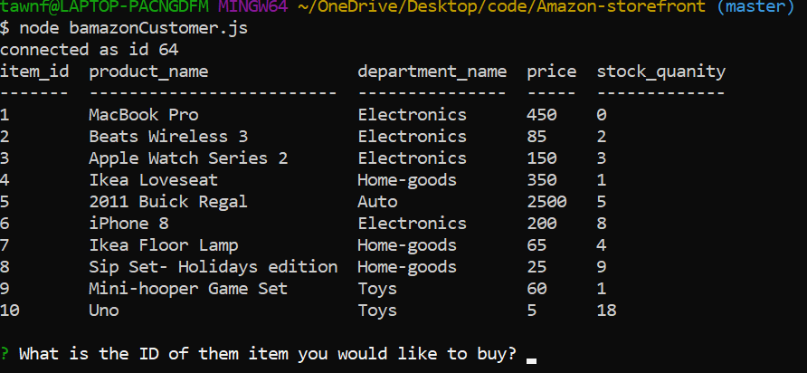
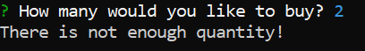
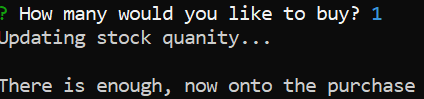
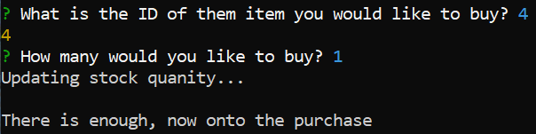
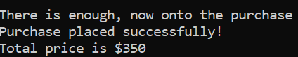
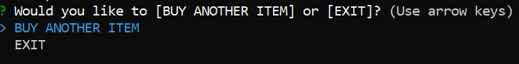
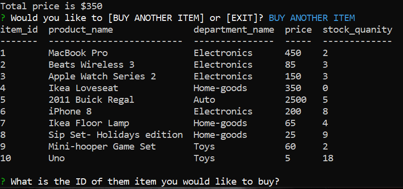
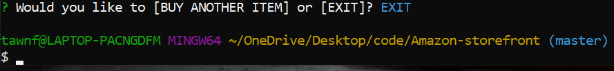

# Amazon-storefront

"In this activity, you'll be creating an Amazon-like storefront with the MySQL skills you learned this unit. The app will take in orders from customers and deplete stock from the store's inventory."

This application uses the data stored in MySQL workbench and runs it on Git Bash to take live input. 
It starts off by showing the user the table "products" 

After intially showing the user the table of products, it then asks the user for the ID of the item they want to purchase. 

After taking the input ID from the user, it then calls a function to check the inventory to make sure there is quantity in stock. If the item is sold out, it will display a message to the user saying it is unavailable.

If the item is available to buy, it will then ask the user for the quantity they want to purchase. 

If there is quantity available to fulfill the user input for how many of the items they want to purchase, it will take the user to the final steps of the transaction. 

If there isn't enough quantity to fullfill the users request, it will display to the user that there is not enough quantity.

The application then runs a function to update the stock on the products table. It then finalizes the purchase and gives the user the total price. 

After the transaction is over, it asks the user if they want to buy another item or exit the application. If they choose to buy another item, it will initilize the first function readProducts and display the updated products table.

If the user chooses to exit, it will end the connection of the application. 

Link to deployed site here: https://drive.google.com/file/d/1jCl1Jq_CXEqS8v5lFfnNBZ16ochZ2qW0/view
Check out my GitHub page here: https://github.com/tawnfran/Amazon-storefront
Author: Tawny Francis

Made for Penn LPS Coding Bootcamp MySQL homework

